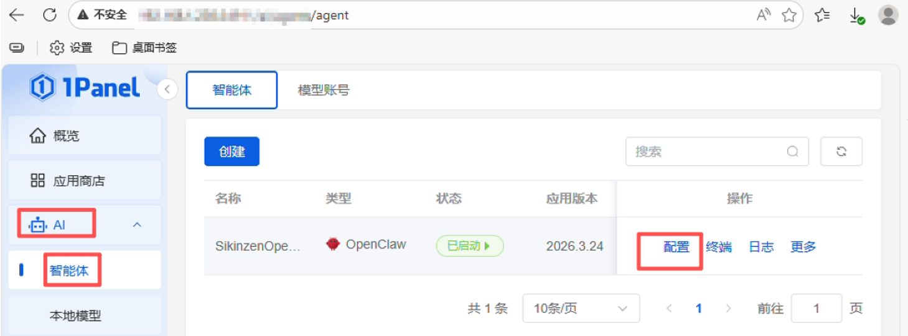
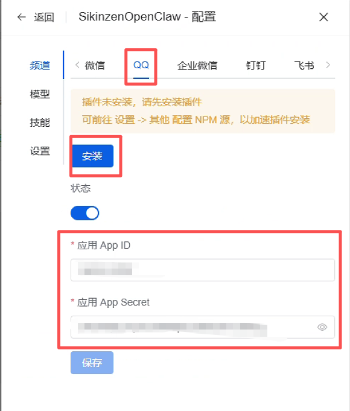
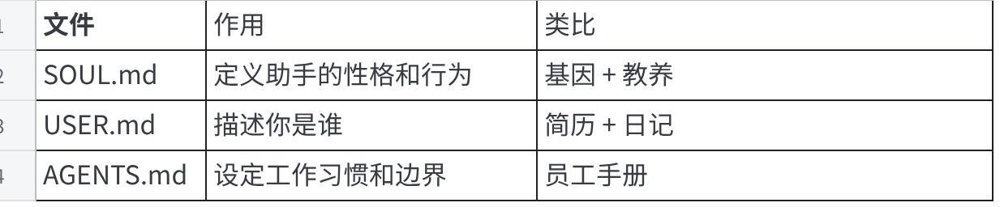

## 一、OpenClaw 是什么？

OpenClaw 是一个开源项目，可以理解为**个人 AI 代理平台**，也被称为"AI 管家"或"数字管家"。

它运行在你的电脑或服务器上，通过连接各种聊天工具（Discord、Telegram、WhatsApp、Signal 等）作为操作界面。其核心理念是**让 AI 成为你的代理，去接触设备和数据并完成任务**。

**主要能力：**

- **理解自然语言指令**：能总结网页、查询价格、管理日历、创建待办、为你的代码写注释等
- **控制外部服务**：通过连接各种 API（Spotify 放音乐、控制智能家居，甚至操作 Photoshop 等应用）
- **接入大模型**：支持接入 OpenAI、Anthropic 等云端 API，也支持接入 Ollama 等本地模型，注重隐私
- **跨平台通信**：能加入你的群组收发消息、执行命令并回复，相当于把你的 AI 助手带进了各种聊天终端

> 简单说，它就是一个开源、本地托管的"贾维斯"，让你通过自然语言直接与系统和应用交互。

OpenClaw 的结构图可参考：7 天学习路线 —— https://openclaw101.dev/zh/

---

## 二、OpenClaw 核心概念

### 1. Gateway（网关）

Gateway 是 OpenClaw 的核心控制中枢，承担着"大脑"和"路由器"的双重角色。你可以把它理解为：一个能接收指令、调度任务、连接各种模型和服务的服务器。

具体来说，Gateway 主要做这几件事：

**统一入口，连接多个聊天平台**  
OpenClaw 支持 Discord、Telegram、WhatsApp、Signal 等多种聊天工具。Gateway 作为统一入口，同时连接所有这些平台的消息——无论你从哪个应用发指令，Gateway 都会收到并进行处理。

**调度工具和多步执行**  
当你说"帮我查一下天气，然后在 Spotify 放首歌"，Gateway 会：
- 理解意图
- 调用对应的功能模块（天气 API、Spotify 控制器）
- 将结果原路返回给你

**管理 Agent 和会话**  
Gateway 维护着每个用户的会话状态和上下文，让 AI 能够连续回答问题，而不是每次都"失忆"地开启新对话。

**对接 AI 模型**  
Gateway 负责与 OpenAI、Anthropic 或本地 Ollama 等 AI 模型通信。它把用户指令发给模型，再把模型的回复转发到聊天平台。

**承载系统和功能**  
OpenClaw 的功能通过"插件"来扩展，这些模块都在 Gateway 下运行。你可以通过配置来启用或禁用特定功能。

**运行时表现：**
- 启动一个 Gateway 服务（可以是后台进程或 Docker 容器）
- 配置好各聊天平台的 Token 和 Bot 密钥
- Gateway 同时连接这些平台，开始处理消息

**一句话总结：**
如果把 OpenClaw 比作一个"智能管家"，Gateway 就是管家的"大脑和电话系统"——能同时接听微信、短信、对讲机，收到指令后判断该动嘴、动手还是放音乐，再把结果告诉对应的人。

在配置文件中，Gateway 设置通常涉及：
- `gateway.port`：Gateway 绑定的本地端口
- `gateway.platforms`：连接哪些聊天平台（discord、telegram 等）
- `gateway.agents`：连接哪些 AI Agent

在 1Panel 上部署 OpenClaw 时，通过对应的应用商店项即可完成，Gateway 是需要暴露端口并进行安全配置的核心服务。

---

### 2. Agent（代理）

Agent 是实际执行任务的"AI 大脑"。每个 Agent 都有独立配置，包括：

- 使用哪个 AI 模型（GPT-4、Claude，或本地 Ollama 等）
- 系统提示词（定义它的角色和风格）
- 可用工具集（决定它能操作什么）

你可以创建多个 Agent，比如一个"程序员 Agent"、一个"家庭管家 Agent"。Gateway 根据消息来源和意图，将指令路由到对应的 Agent。

---

### 3. Skill（技能）

Skill 是 OpenClaw 的功能扩展单元，类似于"能力模块"。每个 Skill 都是 Agent 可以直接使用的一项能力：

- 控制智能家居
- 记录笔记
- 发送邮件
- 操作日历
- 执行 Shell 命令

Skill 是模块化的，可以按需安装/卸载，甚至自己编写。对于开发者来说，Skill 就是一段定义了"描述、参数、执行逻辑"的代码。OpenClaw 社区提供了大量开箱即用的 Skill。

---

### 4. Channel（通道）

Channel 是 Agent 与用户之间的"对话接口"。Gateway 通过 Channel 连接各个聊天平台：

- Discord Channel
- Telegram Channel
- WhatsApp Channel
- Signal Channel
- 以及 Slack、Matrix 等

每个 Channel 维护着对应平台的连接状态、消息收发和用户身份识别等功能。配置文件里涉及 Bot Token 的地方，就是在配置 Channel。

---

### 5. Tool（工具）

Tool 是比 Skill 更细粒度的功能单元。一个 Skill 可能包含多个 Tool：

- "天气查询" Skill 可能包含 `get_current_weather` 和 `get_forecast` 两个 Tool
- "浏览器控制" Skill 可能包含 `navigate_to_url`、`click_element`、`extract_text` 等 Tool

Agent 在运行时，根据用户指令选择并调用合适的 Tool。Tool 通常有明确的输入输出定义，供 AI 模型理解和调用。

---

### 6. Memory（记忆）

OpenClaw 支持多种形式的记忆：

- **短期记忆**：当前会话的对话历史，存储在实时内存中
- **长期记忆**：跨会话的持久化信息，如用户偏好、重要事实，通过向量数据库（Chroma、Pinecone 等）支持

这让 Agent 能够"记住你"，而不是每次都开启全新对话。

---

### 7. Workflow（工作流）

Workflow 是预定义的自动化流程，由多个步骤组成：

- "每日简报" Workflow：抓取新闻 → 提取摘要 → AI 总结 → 发送到指定频道
- "代码审查" Workflow：拉取 PR → 运行 Lint → 生成摘要 → 评论到 GitHub

Workflow 可以定时触发，也可以由指令触发，是 OpenClaw 实现自动化的核心机制。

---

### 8. Provider（提供商）

Provider 指 AI 模型的服务提供方：

- OpenAI（GPT 系列）
- Anthropic（Claude 系列）
- 本地 Ollama（Llama、Mistral 等开源模型）
- 或其他兼容 API

你可以配置多个 Provider，让不同 Agent 选用不同模型（比如简单任务用本地模型省钱，复杂任务用云端强模型）。

---

### 9. Session（会话）

Session 代表一次完整的交互上下文。每个用户在每个 Channel 中都有独立的 Session，用于：

- 维护对话历史
- 存储用户状态（如"正在等待确认删除操作"）
- 支持多轮对话和复杂问题的逐步解决

Session 是 Agent 能进行"多轮对话"和"深入交互"的基础。

---

### 10. 概念之间的关系

```text
用户 → Channel（消息接发）
        ↓
     Gateway（路由调度）
        ↓
      Agent（AI 大脑）
        ↓
  Skill / Tool（调用工具）
        ↓
    Memory（读取记忆，可能触发 Workflow）
        ↓
      结果原路返回
```



---

## 三、OpenClaw 常用命令

```bash
openclaw skills list          # 列出技能列表
openclaw plugins list         # 列出插件列表
openclaw doctor               # 系统诊断
openclaw status               # 查看服务状态
openclaw gateway status       # 查看 Gateway 服务状态
openclaw health               # 健康检查
openclaw configure            # 修改配置（模型、频道等）
openclaw daemon restart       # 重启后台进程
openclaw daemon logs          # 查看后台日志
openclaw onboard              # 初始化引导
```

---

## 四、OpenClaw 的"大脑"架构

详情可参考：https://openclaw101.dev/zh/day/3

### 1. SOUL.md — 灵魂档案

SOUL.md 是 AI 的"性格说明书"。它定义你是谁、怎么说、做什么、不做什么。

> 你不是聊天机器人。你在成为某个人。

### 2. USER.md — 用户档案

USER.md 写了一部分给"你"（人）看，写了一部分给 AI 看。你对自己描述得越详细，AI 就越能帮到你。

### 3. AGENTS.md — 代理手册

AGENTS.md 描述了 AI 的工作方式和操作规范。如果说 SOUL.md 是"我是谁"，AGENTS.md 就是"我怎么干活"。



---

## 五、OpenClaw 核心技能详解

### 1. Agent Reach — 桌面 / 应用操控

OpenClaw 的 Agent Reach 技能主要解决 AI 如何突破纯对话的限制，实际操控外部设备与软件。换句话说，**让 Agent 不再局限于"聊天窗口"，而是可以：**

- **操控图形界面**：模拟鼠标键盘输入，直接控制本地或远程的应用程序、操纵系统设置
- **执行端到端任务**：比如自动生成报表、批量处理信息、剪辑视频或编辑文档，通过邮件客户端发送出去
- **连接物联网设备**：控制智能硬件（传感器、机械臂、智能家居中控），也可以通过插件执行复杂指令

**使用场景**就是打通 AI 的"信息"与房间里的"物理世界"，产生实际影响。需要注意，OpenClaw 的具体实现可能会随官方文档和版本迭代而变化，实际使用时以对应版本的技术说明为准。

---

### 2. Agent Browser — 网页自动化

Agent Browser 技能可以理解为**为 AI 配备了一个"隐形浏览器"**，一个完全由 AI 来"看"和"操作"的浏览器，而不是调用网页 API——相当于 AI 长了一双在真实浏览器里看网页的眼睛。

主要能力：

- **页面导航与交互**：输入网址、点击按钮、填写表格、翻页等
- **状态识别与判断**：读取渲染后的页面内容（含动态加载的 Ajax 数据），判断是否包含特定文本或元素
- **自动化任务执行**：自动登录网站、抓取搜索结果、提取社交媒体的动态信息、完成多步骤的订票或预约

底层通过内置浏览器引擎实现，支持执行 JavaScript、等待异步加载、处理登录态和 Cookie。典型的指令像是"打开某个网页、等两秒、然后提取某段文字"这样的多步操作。

**Agent Reach 与 Agent Browser 的分工：**

| 技能 | 定位 | 举例 |
|---|---|---|
| Agent Reach | 通用目标操控：模拟操作桌面应用 | 填写 Excel、控制操作系统 |
| Agent Browser | 专属浏览器操控：处理网页动态数据和交互 | 登录网站、抓取 Ajax 内容 |

> 简单说：一个负责"操控桌面"，一个负责"操控网页"。



---

### 3. cron-scheduling — 定时任务

cron-scheduling 技能让 AI 能够定时、自动执行任务。类似于 Linux 系统的 cron 机制，让 Agent 具备**时间感知能力**，不再只会被动响应指令。

主要功能：

- **定时执行**：在精确的节拍时间触发某件事，如"明天下午 3 点提醒我开会"
- **循环调度**：按固定频率重复执行，如"每天上午 8 点抓取新闻"、"每小时分析一次日志"
- **任务管理**：动态查看、删除、暂停已创建的定时任务

典型应用：

- 自动邮件处理：每 30 分钟检查一次邮箱，对特定主题邮件自动回复
- 信息与报告：每天凌晨汇总当日新闻摘要，发送到指定联系人
- 系统维护操作：在预定时间通过 Agent Reach 打开备份程序，或通过 Agent Browser 登录系统抓取数据

> 需要配合持久化存储（防止重启丢失）和时区配置一起使用。

与前两个技能的关系：cron-scheduling 负责"何时做"，Reach 和 Browser 负责"怎么做"。

---

### 4. DeepReader — 文档深度解析

DeepReader 的核心价值是让 AI 能够深度阅读和理解复杂文档，而不止于普通文本提取能处理的内容。

它主要解决：

- **复杂格式解析**：能解析 PDF（含扫描件）、Word、Excel、PPT 等文件，准确提取文本、图表数据以及复杂排版内容
- **富文本内容识别**：识别文档中图片中的文字（OCR），解析图表结构，将非结构化内容转化为结构化数据
- **精准问答与引用**：支持对超长文档进行问答检索，精确定位到相关段落，并提供准确的原始引用

**与普通文本提取的区别：**

| 特性 | 普通提取 | DeepReader |
|---|---|---|
| 提取范围 | 仅纯文本 | 文本、表格、图像、排版信息 |
| 扫描件支持 | 不支持 | 支持 OCR |
| 问答精度 | 粗糙 | 可精确定位到段落 |

典型使用场景：
- 从百页财报 PDF 中提取关键数据并分析趋势变化
- 将扫描的合同图片转化为可检索的文本
- 处理上百页技术文档手册，回答关于某个配置参数的具体问题

**与其他技能的关系：** 如果说 Agent Reach 管"桌面"、Agent Browser 管"网页"、cron-scheduling 管"时间"，那 DeepReader 管的就是"静态文档"，为其他技能提供输入。例如：cron 定时抓取一份报告 → DeepReader 读取每日报表 → Agent Reach 将摘要填入 Excel。

---

### 5. find-skills — 能力发现

find-skills 是一个元功能——让 AI 在运行时动态发现自己的能力清单，比如查询 DeepReader 是否已启用。

它与 DeepReader 的协作关系：

- DeepReader 用于**处理** PDF、Word、Excel 等复杂文档的具体功能
- find-skills 是一个**元功能**——当 AI 需要处理文档时，会通过 find-skills 检查系统是否已安装 DeepReader；如果没有，AI 可以根据提示降级为简单文本提取，或建议用户安装该技能

实际价值：

- **动态适配**：AI 在不同设备/不同服务器上加载的技能集合可能不同，通过 find-skills 自检，可以避免直接调用不存在的技能而报错
- **自动化流程保障**：在复杂工作流中（如定时抓取网页 → DeepReader 分析报告），可先通过 find-skills 验证所需能力是否就绪

**一句话总结**：DeepReader 是干活的工具，find-skills 是查看工具箱里有什么。前者处理文档内容，后者管理能力边界。

---

### 6. token-optimizer — 对话压缩

token-optimizer 的核心价值是**智能压缩对话中的 token 消耗**，防止对话因为超出模型限制而中断，同时控制使用成本。

主要功能：

**自动压缩对话历史**
- 当对话超过设定阈值时，自动对更早的对话轮次进行摘要提取，大幅减少 token 但保留关键信息
- 例如：10 轮对话 5000 token → 压缩成摘要 500 token

**智能选择性裁剪**
- 在保证对话连续性的前提下，对中间部分进行关键信息提取
- 可选择性地忽略冗余内容：重复的代码块、无意义的日志输出

**优先级管理**
- 为不同内容分配保留优先级：系统指令 > 用户重要信息 > 工具调用结果 > 历史对话
- 支持标记某些信息"永不压缩"（如用户明确要求保留的数据）

典型使用场景：
- 长时间运行的客服机器人：避免每月对话因 token 超标而中断
- 处理大文件的 AI：DeepReader 读取财报后压缩提取，再进行下一步分析
- 自动化日报生成：每天自动抓取+分析，优化长期记忆，丢弃临时细节

> 注意事项：压缩会丢失一些细节，需要在成本与准确性之间权衡。通常提供"摘要 + 关键引用"模式，而非保留原句。

---

### 7. skillhub-preference — 偏好存储

skillhub-preference 的核心价值是**管理和持久化存储用户对不同技能的偏好设置**，让 AI 能够"记住你喜欢怎么被服务"，并在后续操作中自动应用这些偏好。

主要功能：

**偏好存储与查询**
- 记住用户对特定技能的设置，如："使用 DeepReader 时默认提取摘要而非全文"、"Agent Browser 使用无头模式且不显示窗口"
- 支持按技能名称、用户 ID、会话 ID 等多维度查询

**动态覆盖与继承**
- 用户可随时修改偏好，如"转为无头模式"不影响全局设置
- 支持层级结构：用户全局偏好 > 技能默认偏好 > 单次任务指定

**跨会话持久化**
- 偏好存储在本地或云端，重启 Agent 后仍然有效
- 例如：你告诉 AI "以后 DeepReader 处理 PDF 时只提取前 10 页"，这个设置会一直生效直到你修改

典型使用场景：
- 个性化设置：将 token-optimizer 的压缩阈值设为 3000 token（默认可能是 5000）
- 自动化流程默认行为：cron-scheduling 创建的定时任务默认时区设为 Asia/Shanghai
- 减少重复指令：无需每次都说"使用 Agent Browser 时超时设为 30 秒"，系统自动应用

---

### 8. stock-monitor-pro — 股票监控

stock-monitor-pro 是一个专用金融技能，用于实时监控股票行情，支持自定义多维监控指标并触发提醒或自动操作。

> 注意：此技能不包含**推荐股票**的功能。

核心能力：

- **市场数据监控**：A 股、港股、美股等主要市场的实时/延时数据
- **多维预警**：支持价格突破、涨跌幅、成交量异动、换手率、RSI、MACD 等技术指标条件
- **自动响应**：触发预警后可联动执行操作：
  - Agent Browser：打开财经网站查看详情
  - Agent Reach：打开交易软件（需自行授权）
  - cron-scheduling：定时生成日报
  - 邮件/微信通知等

典型应用：
- "假如某股票 5 分钟内涨幅超过 3%，立刻通知我"
- "每天收盘后生成持仓股的涨跌幅和成交量总结，发送到邮箱"
- "茅台跌破 1500 元时，用 Agent Browser 查看当日新闻"

与其他技能的关系：stock-monitor-pro 是专用技能，聚焦金融监控；Reach、Browser、cron 等提供通用的执行能力。

> 注意：需要接入数据源（行情 API），免费接口可能存在延迟，自动化交易下单需充分模拟测试。

---

### 9. web-search — 网络搜索

web-search 的核心价值是让 AI 能够搜索互联网获取实时信息，弥补训练数据截止日期带来的知识盲区。

主要功能：

**实时信息获取**
- 查询新闻动态、天气预报、股票行情、赛事比分等动态数据
- 示例："今天北京天气如何？""茅台最新股价？""欧冠决赛比分？"

**知识补充与验证**
- 获取训练数据中不存在或不够详细的信息
- 验证事实性陈述，给出时效性更强的回答

**多源聚合**
- 从多个搜索引擎和数据源获取结果
- 支持限定特定来源

**与其他技能的关系：**

| 技能 | 分工 |
|---|---|
| web-search | 调用搜索引擎 API，返回摘要和链接 |
| Agent Browser | 打开具体网页进行深度交互（登录、填表等） |

> 简单说：web-search 是给 AI 装的"搜索接口"，问天气查股价；Agent Browser 是自己去浏览器里打开网页操作。

典型使用流程：

```text
用户问："2025 年诺贝尔经济学奖得主是谁？"
→ AI 调用 web-search，关键词"2025 Nobel Prize Economics"
→ 从多个来源确认结果
→ 返回准确答案
```

注意事项：
- 需要配置搜索 API 密钥
- 可限制时间范围（如"过去 24 小时内"）
- 支持站内搜索限定（如 `site:bbc.com`）
- API 调用通常按次计费，建议配合 token-optimizer 避免重复查询

---

### 10. email-connector — 邮件收发

email-connector 为 OpenClaw 提供邮件收发能力，让 AI Agent 可以直接管理电子邮件。

主要功能包括：连接邮箱账户（IMAP/SMTP）、读取收件箱和特定文件夹中的邮件、发送和回复邮件、根据规则自动分类和处理邮件。

---

### 11. file-system — 本地文件读写

file-system 技能的核心价值是让 AI 能安全地读写本地的文件和目录，是实现文件自动化管理的基础能力。

主要功能：

**文件操作**
- 读取、写入、删除、移动、复制文件和目录
- 支持文本文件（TXT、JSON、YAML、CSV）和二进制文件（图片、PDF）

**目录管理**
- 列出目录内容，支持递归遍历
- 创建、删除文件夹
- 获取文件元数据（大小、修改时间、权限等）

**路径安全控制**
- 通过限定只允许访问特定目录（如 `/workspace` 或用户指定的文件夹），防止 AI 误删系统文件或泄密
- 支持设置白名单/黑名单路径

典型使用场景：
- **持久化存储**：保存 token-optimizer 压缩后的对话摘要、cron-scheduling 的运行日志
- **工作流中间数据**：读取文件中的报告数据，传给 DeepReader 做进一步分析
- **配置管理**：读取 skillhub-preference 存储的偏好设置文件
- **数据导出**：将 web-search 的查询结果保存为 CSV 或 Markdown 文件

**与其他技能的关系：** file-system 是基础设施——Reach 操作图形界面，Browser 操作网页，DeepReader 分析文档内容，但它们读写文件时都依赖 file-system 或等效能力。

安全注意事项：
- 路径沙箱：默认只能访问工作目录（如 `./workspace`），无法读取系统敏感文件
- 危险操作确认：删除文件夹或覆盖文件需要显式确认，通常需要人工授权
- 大小限制：读取超大文件（>500MB 的日志）可能被限制或分批读取

---

## 六、接入 QQ 机器人

参考教程：https://www.appinn.com/openclaw-channel-qqbot/

### 准备工作

注册并获得 QQ Bot 的 AppID 和 AppSecret（**以下为示例，请替换为真实值**）：

| 类型 | AppID | AppSecret |
|---|---|---|
| 频道机器人-公域 | `<your-appid-public>` | `<your-appsecret-public>` |
| 频道机器人-私域 | `<your-appid-private>` | `<your-appsecret-private>` |

### 在 OpenClaw 中配置 QQ 频道

通过 1Panel 进入 OpenClaw 容器的终端，执行以下命令：

**1. 安装 QQBot 插件**

```bash
openclaw plugins install @tencent-connect/openclaw-qqbot@latest
```

**2. 添加 QQ 频道绑定**

```bash
openclaw channels add --channel qqbot --token "<your-appid>:<your-appsecret>"
```

**3. 重启 OpenClaw 服务**

```bash
openclaw gateway restart
```

> 注意：由于是通过 1Panel 的容器方式部署，执行命令时需要在 1Panel 中进入 "AI → 容器 → OpenClaw" 的终端执行，保证命令在正确的容器环境中运行。

在 QQ 频道中 @ 机器人提问，如果能正常回复，就说明配置成功了。

---

## 附录：1Panel 安装 OpenClaw 默认技能

1Panel 安装 OpenClaw 时默认会安装哪些技能？各文件的加载顺序（优先级从高到低）：

```text
项目根目录 /skills（当前项目）
~/.agents/skills
~/.openclaw/skills（用户安装的托管技能等）
bundled skills（OpenClaw 安装包自带）
skills.load.extraDirs 指定的目录
```

> 即：默认 = 当前版本自带 `bundled` + 以上目录中的所有文件。具体列表因版本而异，可通过 `openclaw skills list` 查看。

---

## 学习资源

- OpenClaw 七天学习路线：https://openclaw101.dev/zh/day/3
- Gateway 配置详解：https://openclaw101.dev/zh/day/4
- Skill 开发进阶：https://openclaw101.dev/zh/day/5
- 工作流与自动化：https://openclaw101.dev/zh/day/6


