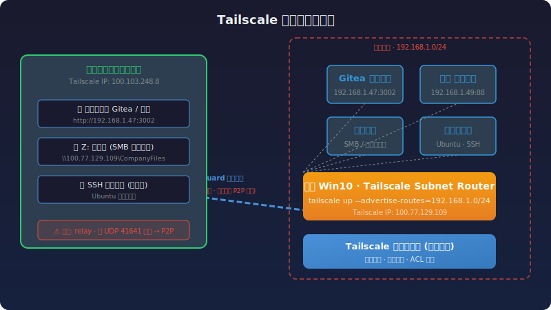

## 背景

作为一家手机厂商的技术负责人，我日常需要处理以下场景：

- **出差时**访问公司内网的 Gitea 代码仓库（`192.168.1.47:3002`）和禅道项目管理系统（`192.168.1.49:88`）
- **在家办公时**读写公司电脑上的各类文档和资料
- **远程 SSH** 到公司内的 Ubuntu 编译服务器

公司的内网服务全部跑在 `192.168.1.0/24` 网段，没有一个暴露到公网。传统 VPN 方案存在配置繁琐、端口暴露、速度慢等问题。

经过对比调研，我选择了 **Tailscale** 方案，全程搭建不到 5 分钟，零端口暴露，全部流量走 WireGuard 加密隧道。



## 方案对比：为什么选 Tailscale？

主流的四类内网穿透方案对比：

| 维度 | **Tailscale** | frp | ZeroTier | 原生 WireGuard |
|------|:------------:|:---:|:--------:|:-------------:|
| 底层技术 | WireGuard | TCP/UDP 反代 | 自研 VXLAN | WireGuard |
| 组网模型 | Mesh P2P | 客户端-服务端 | Mesh P2P | 点对点 |
| NAT 穿透 | ⭐⭐⭐⭐⭐ 多种策略+中继兜底 | ❌ 需公网IP | ⭐⭐⭐⭐ | ⭐⭐ 需手动 |
| 部署难度 | ⭐⭐⭐⭐⭐ 5分钟 | ⭐⭐⭐ 需服务器 | ⭐⭐⭐⭐ 较简单 | ⭐⭐ 全手动 |
| 数据路径 | 打洞成功→直连 | 全经服务器 | 打洞成功→直连 | 纯直连 |
| 访问控制 | ACL 细粒度规则 | 无 | 简单 | 无 |
| 免费额度 | 100 设备 / 3 用户 | 开源免费 | 25 设备 | 完全免费 |

**Tailscale 的核心优势在于**：把 WireGuard 的军用级加密和 mesh 组网能力包装成了"装客户端→登录→通"的傻瓜式体验。底层打洞策略极为激进，同时 DERP 中继作为兜底，确保总有路可走。

> 我最终选择了 **Tailscale SaaS 免费版**，理由很直接：不需要维护服务器、自动密钥轮换、ACL 访问控制开箱即用。控制平面（密钥交换）在 Tailscale 的境外服务器上，但业务数据打洞成功后是端到端 P2P 直连，不经过任何第三方。

## 架构设计

核心思路：一台机器当 Subnet Router，把整个公司内网网段"广播"到 Tailscale 虚拟网络。

```
公司 Win10 办公电脑（Subnet Router）
  tailscale up --advertise-routes=192.168.1.0/24
  → 把 192.168.1.0/24 暴露到 Tailscale 网络

你的笔记本（任何地方）
  tailscale up --accept-routes
  → 接受 Subnet Router 广播的路由

结果：笔记本上直接访问 192.168.1.47 → 流量自动走 Tailscale 隧道 → 公司 Win10 转发 → 实际内网服务
```

关键点：
- **只开 Subnet Router**，不开 Exit Node（不需要全局走公司代理）
- 所有流量经过 WireGuard 加密，即使走 DERP 中继也是加密的
- 访问内网服务就像在局域网一样，不需要改任何地址

## 搭建步骤

### 第一步：注册 Tailscale（2 分钟）

1. 浏览器打开 [login.tailscale.com/start](https://login.tailscale.com/start)
2. 用 GitHub 账号 OAuth 登录（免费版支持 3 用户 / 100 设备）
3. 登录后获得一个 tailnet，名字类似 `yourname.github`

### 第二步：在公司电脑和笔记本上安装客户端

下载 [Tailscale for Windows](https://tailscale.com/download/windows)，安装后用同一 GitHub 账号登录两台机器。

装好后在笔记本上验证：

```powershell
tailscale status
# 100.77.129.109  desktop-ra0nmat  sikinzen@  windows  -
# 100.103.248.8   alex            sikinzen@  windows  -
```

两台机器出现在同一个 tailnet 里就是通了。

### 第三步：配置 Subnet Router

在公司 Win10 上，**管理员 PowerShell**：

```powershell
tailscale up --advertise-routes=192.168.1.0/24
```

然后去 [Tailscale 管理后台](https://login.tailscale.com/admin/machines)，找到公司 Win10 那台设备，在路由设置里 **Approve** `192.168.1.0/24`。

在笔记本上接受路由：

```powershell
tailscale up --accept-routes
```

### 第四步：防火墙放行

在公司 Win10 上放行 Tailscale 网段的 ICMP 和 SMB：

```powershell
# 放行 ICMP（方便运维调试）
netsh advfirewall firewall add rule name="Allow Tailscale ICMP" protocol=icmpv4:8,any dir=in action=allow remoteip=100.64.0.0/10

# 放行 SMB 文件共享
netsh advfirewall firewall add rule name="Allow SMB from Tailscale" dir=in action=allow protocol=TCP localport=445 remoteip=100.64.0.0/10
```

### 第五步（可选）：SMB 文件共享

如果需要远程读写公司电脑上的文件，在公司 Win10 上配置 SMB 共享：

1. 创建一个集中共享文件夹（如 `D:\CompanyFiles`），右键 → 属性 → 共享
2. 用符号链接把散落的目录汇聚进来：

```powershell
mklink /D "D:\CompanyFiles\项目文档" "D:\Projects\Docs"
mklink /D "D:\CompanyFiles\技术资料" "E:\TechDocs"
```

3. 在笔记本上映射为网络驱动器：

```powershell
net use Z: \\100.77.129.109\CompanyFiles /persistent:yes
```

> Z: 盘就是你全部的公司文件，双击秒开，就像在本地一样。

## 验证

在笔记本上（断开公司网络的情况下）：

```powershell
# 测试 Gitea
curl http://192.168.1.47:3002
# → HTTP 200，返回完整 HTML 页面 ✅

# 浏览器打开禅道
# http://192.168.1.49:88 ✅

# 查看连接状态
tailscale status
# 如果显示 "direct" → P2P 直连，速度最佳
# 如果显示 "relay"  → DERP 中继，速度稍慢
```

## 当前遗留问题

### 速度优化：DERP 中继 vs P2P 直连

目前两台机器之间的连接状态为 `relay "lax"`，意味着数据走的是一条**厦门 → 洛杉矶 → 中国**的路径，延迟约为 150-300ms。原因很直接：公司防火墙屏蔽了 UDP 出站端口 41641，Tailscale 的 P2P NAT 打洞失败，只能 fallback 到 DERP 中继。

```
当前路径（relay）：
  笔记本 ←→ 洛杉矶 DERP 中继 ←→ 公司 Win10

理想路径（P2P）：
  笔记本 ←→ 公司 Win10（端到端直连）
```

**解决方案很简单**：让公司网管放行 Win10 的 **UDP 出站端口 41641**（目标地址不限）。放行后重启 Tailscale：

```powershell
tailscale down && tailscale up --advertise-routes=192.168.1.0/24
```

打洞成功后连接会从 `relay` 变成 `direct`，P2P 直连延迟通常低于 5ms，所有服务的体验会有质的飞跃。

> 这一步完成后，我会更新本文或发布后续文章，记录优化效果。

### 文件访问的当下体验

在当前 relay 模式下：

| 文件类型 | 体验 |
|---------|------|
| Word / Excel / PDF（< 10MB） | 可用，打开有 2-5 秒延迟 |
| 小文件批量操作 | 较慢，每个文件都要建连 |
| 大文件（> 100MB） | 建议先用 robocopy 拉到本地再操作 |

文件操作的核心瓶颈不在方案本身，而在网络路径。P2P 直连一旦建立，所有体验问题都会自动消除——不需要改任何配置。

### 待接入设备

Ubuntu 编译服务器目前尚未接入。等两台 Windows 跑通并优化 P2P 直连后，编译服务器装上 Tailscale 客户端即可实现远程 SSH。

## 总结

用 Tailscale 做内网穿透，我的核心感受是：**易用性和安全性不矛盾**。

5 分钟搭建，零端口暴露，全部 WireGuard 加密流量。方案本身没有"坑"，唯一需要协调的是公司防火墙放行 UDP 出站——但这拿到 P2P 直连后，体验会是降维打击。

如果你也需要类似场景，不妨试试。整套方案只用了 Tailscale 免费版 + Windows 原生功能，不花一分钱。

---

*本文是"网络与运维"系列的第一篇。后续将更新：P2P 直连优化、Ubuntu 编译机接入、自建 DERP 中继等话题。*
